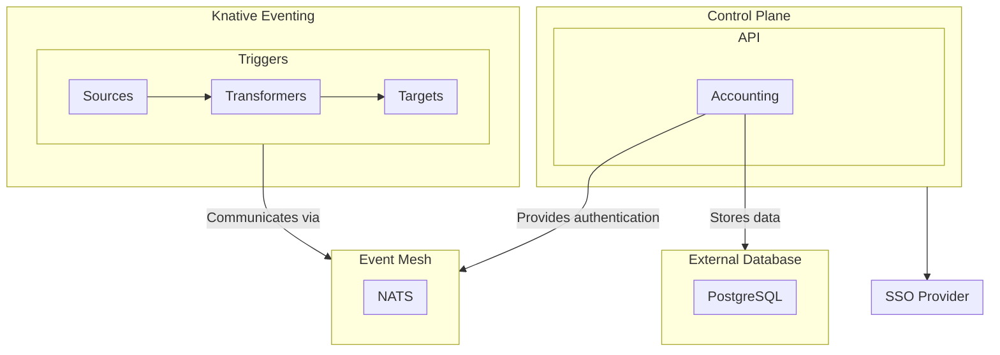

# typhoon

[](https://github.com/ZEISS/typhoon/actions/workflows/release.yml)
[](https://pkg.go.dev/github.com/zeiss/typhoon)
[](https://goreportcard.com/report/github.com/zeiss/typhoon)
[](https://twitter.com/SwiftOnSecurity)
[](https://github.com/auchenberg/volkswagen)
[](https://opensource.org/licenses/Apache-2.0)

An event bridge for applications and services build on an event mesh with a team-oriented self-service control plane.

## Design

Every software system has design goals. Properties that it should provide io its users to create value. Typhoon has the following design goals:

* **Team-based self-service control plane**. Teams control their own event sources, triggers, and targets. They also control their users their permissions.
* **Event mesh**. The system is capable to route events from producers to consumers in hybrid cloud environemts.
* **Streaming**. The system is capable to stream events from producers to consumers. That means it is capable of replaying events not only queueing them.
* **Event bridging**. The system is capable to bridge events from different sources to different targets, also transforming them. Furthermore, this should use a declarative approach.
* **Scalability**. The system is capable to scale horizontally and vertically.
* **Resilience**. The system is capable to recover from failures.
* **Security**. The system is capable to secure the communication between producers and consumers.
* **Open standards**. The system is based on open standards like [NATS.io](https://nats.io/) and [Knative Eventing](https://knative.dev/docs/eventing/).

## Overview

Typhoon is built on top of [NATS.io](https://nats.io/) and [Knative Eventing](https://knative.dev/docs/eventing/). It provides a control plane for managing event sources, triggers, and targets. It also provides an API for managing the control plane.



## Helm

[Helm](https://helm.sh/) can be used to install Typhoon to your Kubernetes cluster.

```shell
helm repo add typhoon https://zeiss.github.io/typhoon
helm repo update
```

Install Typhoon to your cluster in a `typhoon` namespace.

```shell
helm install typhoon typhoon/typhoon --create-namespace --namespace typhoon
```

## Prerequisites

* Kubernetes `v1.28` or newer
* Knative Eventing `v1.15` or newer
* Knative Serving `v1.15` or newer
* Helm `3.0` or newer

## Installation

Typhoon depends on [Knative Eventing](https://knative.dev/docs/) and [NATS](https://nats.io).

## Development

You can use [minikube](https://minikube.sigs.k8s.io/docs/) to run a local Kubernetes cluster.

```shell
minikube start
```

You need to install Serving and Eventing for Knative.

## License

[Apache 2.0](/LICENSE)
