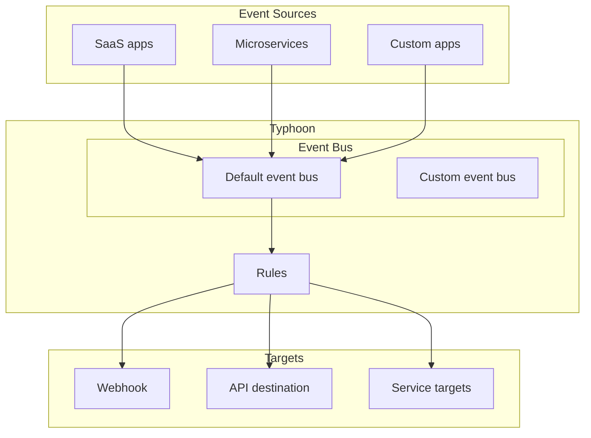

# How it works

Typhoon is a cloud-native technology that help you to receive, filter, transform, route and deliver events
across a wide-range of sources and targets.

# Use cases

## Application integration

Send events from on-premises applications to the cloud and back and use the events to build new applications.

## IT Automation

Use events to automate your infrastructure for validating configurations, monitoring, and alerting.
Audit user behavior, or remediate security incidents.

## SaaS Integrations

Receive events from your SaaS applications, like Salesforce or ServiceNow, enrich your data,
and send the results back or to other destinations.